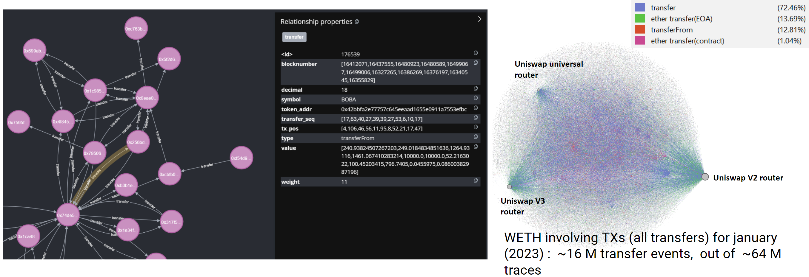

# eth-tracker-db


*Example (left: Neo4j, Right: Gephi visualization)*
***


Overview
```
├── LICENSE
├── README.md
├── db_util # utility scripts for interacting with DBs
│   ├── neo4j_service.py
│   └── pg_service.py
├── docker # docker scripts for setting up DBs
│   ├── neo4j_docker.sh
│   ├── postgre_docker.sh
│   └── postgre_with_pgadmin
├── eth_tracker_output # output directory for eth-tracker jobs
│   └── example
├── mount # local mounted volumes for docker containers
│   ├── neo4j
│   └── postgres
└── scripts # example scripts to load csv files into DBs
    ├── example_csv_to_neo4j.py
    └── example_csv_to_postgre.py

```